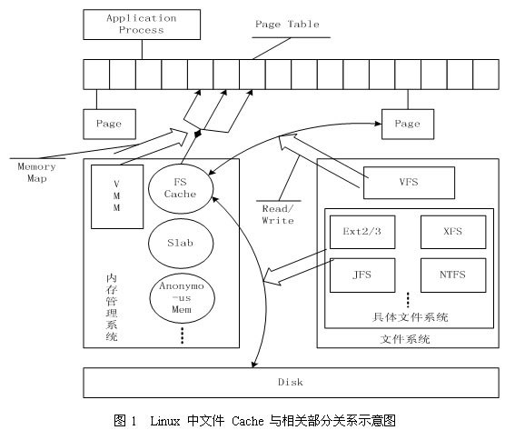
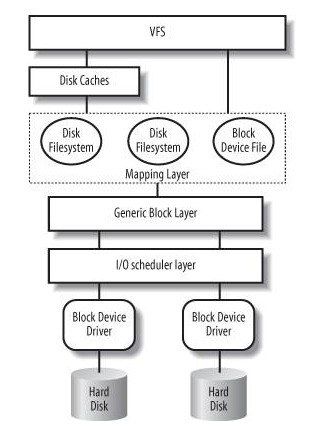

## linux系统中 内存、缺页相关总结

在系统运维中有时会发现某些进程异常，从而导致系统负载或cpu使用异常。此时运维新手（比如我）由于缺乏操作系统原理相关知识，不能将系统查询工具与实际的问题联系起来，经常找不到症结所在。本文试图结合网上的文章与自己的实践，对学习到的知识进行小结。

1. linux系统FS VFS cache buffer 之间的关系  
问题：在free命令中可以看到有 cache 与 buffer 两项，这两项分别指什么，有什么不同。 

	从百度大牛那边了解到：cache 与 buffer的内容都在内存中，在内存不足时都可以被内存管理器回收。这两者之间的不同主要是因为VFS（虚拟文件系统）。当应用程序读取文件内容时并不是直接操作文件系统，操作系统提供了一种虚拟文件系统的机制，通过VFS来将各个FS的借口统一化，（所以各种文件系统都能统一到一个目录树中）此时读取文件时首先经过VFS，VFS再调用FS具体的功能函数去读取相应内容，而cache就是VFS拿到后的内容，操作系统会将这部分内容缓存到内存中已加快后续访问使用。  
	buffer存储的内容大多是不经过文件系统处理的数据，比如说网卡数据，其他块设备的数据等。  
	
	linux cache 体系架构
	
	
	上面的示意图给出了linux系统中应用、文件系统、内存在cache中的协调关系。  
	
	从图中可以看到，**具体的文件系统如ex2/3 ex4，负责在文件cache 与存储设备之间交换数据，而位于具体文件系统之上的虚拟文件系统VFS负责在应用程序和文件cache之间通过read/write等接口交换数据。** 内存管理系统负责文件Cache的分配与回收，虚拟内存系统（VMM）允许应用程序和文件cache之间通过memory map方式交换数据。 FS Cache 底层通过slab管理器来管理内存。  
	
	下图清晰地描述了cache所在的位置： 磁盘与VFS的纽带。  
		

2. 虚拟内存  
	2.1  linux内存管理基础
	应用程序在运行过程中并不是直接使用物理内存，操作系统会将物理内存进行映射，以虚拟内存的方式进行管理与使用。虚拟内存以页的方式进行管理，一般为4k。  
	创建进程、程序载入、映射文件、动态内存分配等操作都需要分配内存给进程，进程此时获得的并不是实际内存而是虚拟内存，准确的说是'内存区域'，Linux除了内核外，APP都不能直接操作内存，malloc调用也只是通知APP需要的内存，只有在使用的时候才分配。
	

	2.2 内存页
	2.2.1 页类型  
	- 不能释放的页：加锁页、内核页、保留页  
	- 可交换的页：匿名内存页 可交换指交换到swap分区上，属于某个进程的内存，但在磁盘中没有对应的文件，当内存短缺时，要写到swap  
	- 同步的页：在内存里有修改的文件内容页，需要刷回到磁盘中  
	- 可废弃的页：只读的页，并且在磁盘中有对应文件，一般是静态文件，二进制文件，库。当内存短缺时，这些页可以直接丢弃，放到free list.  
	
	除了第一种页不能回收，其他都可以被回收  
	
	2.2.2 与页回收相关的两种机制   
	
   - kswaped内核线程  
   - pdflush内核线程  
	
	 
	kswapd守护线程的功能是保证有足够多的空闲内存可用。当当前系统的可用内存低于pages_low时，kswapd进程将一次释放32个页，直到空闲内存到达pages_high

	相应的机制是通过一个双LRU链表来实现的。

	如是这个页没有改动，则将这个内存页放到free list。如果这个页改动了，并且有对应的文件系统，将把这个页刷到磁盘。如果这个页改动了，但是匿名页，则将这个页写的swap区
	
	pdflush将对应的文件系统的脏页刷到磁盘。当内存中10%的页是脏页的话，pdflush开始将脏页同步到文件系统，可以调整这个参数的值：vm.dirty_background_ratio  
	
	2.3 缺页中断  
	linux将内存物理地址空间映射到虚拟内存，内核仅会映射需要的内存页，当应用启动时内核依次搜素CPU cache和物理内存，查找是否有相应地内存页，如果不存在，内核将发起一次MPF(major page fault),将磁盘中的数据读出并缓存到内存中。如果在buffer cache中找到了对应的内存页，则将会产生一个MnPF(min page fault)
	linux使用 majflt(major fault) 与 minflt(minor fault)这两个数值表示一个进程自启动以来发生的缺页中断的次数(在使用 ps -o majflt,minflt -p pid查看时)。当一个进程使用资源时该资源并没有分配实际的物理内存，此时就会发生缺页中断。当一个进程发生缺页中断的时候就会陷入内核态，执行以下操作：
	
	1. 检查要访问的虚拟地址是否合法  
	2. 查找/分配一个物理页  
	3. 填充物理页内容（读取磁盘<读文件时>，或者直接置0<malloc调用>，或者啥也不干）  
	4. 建立映射关系（虚拟地址到物理地址）   
	5. 返回重新执行发生缺页中断的那条指令  
	
	在第三步中，如果需要读取磁盘，那么这次缺页中断就是majflt，否则就是minflt。
	
	2.4 进程缺页中断的检查  
	
	1. ps -o majflt,minflt -p pid  
	显示的是进程启动以来的累计值  
	2. pidstat -r -p pid 1  
	显示的是一秒钟的平均值